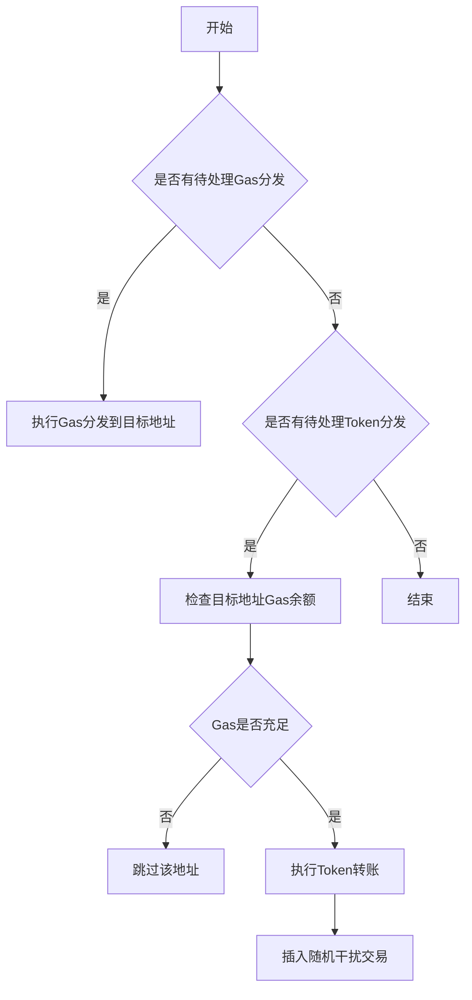

# Token Distribution System

## 🚀 项目概述

本系统是一个**专业级Token分发解决方案**，专为模拟真实投资机构的层级分发行为而设计。系统使用真实的机构级分发模式，通过层级结构、保留机制和双重Gas管理，完全模拟真实世界的Token分发场景。

### ⭐ 最新更新：层级分发系统

**重大功能升级** - 从简单批量分发升级为真实机构行为的层级分发系统：

- 🏢 **层级分发结构**: 主要机构 → 子机构 → 最终用户的真实分发链
- 💰 **智能保留机制**: 每层机构保留30-50%的Token，符合真实行为
- ⛽ **双用途Gas系统**: 区分分发Gas和交易Gas，精确模拟真实需求
- ⏰ **时间窗口控制**: 各机构在不同时间窗口执行，避免被检测
- 🛡️ **增强安全特性**: 多重随机化机制，显著降低检测风险

## 核心需求

### 系统描述

从一个有 ERC20 token 的地址将 token 分散到多个不同地址，中间有多层级，像树形结构一样的分发，模拟项目方将 token 分发给投资者的行为，后面的投资者又可能分发给他下面的子投资者。

### 主要特性

- **无合约设计**: 不使用任何合约，某些机构可以使用批量转账 token，而 gas 的分发只使用基础转账行为
- **任务模块化**: 使用 Hardhat、ethers 完成功能，多个任务放在 tasks 目录下
- **独立分支**: 每条树的分支都是一个独立的机构，各分支在时间上独立操作，层数可能不同
- **HD Wallet 架构**: 树的每个分支使用不同的 HD wallet 创建多个地址，一个 HD wallet 代表一个机构

### 功能模块

#### Gas Fee 分发

- Gas fee 来源于不同交易所转出
- 转到中间地址，再由中间地址分发给其他地址
- 中间地址使用 HD wallet 管理
- 提前随机化 Gas Price 到不同地址上
- Gas 数量仅用于 ERC20 transfer 的 gas

#### Token 分发

- 分发数量随机，使用正态分布（高斯分布）
- 分发时间按一定规则随机，使用泊松过程模拟
- 模拟真实用户行为：当数量大于某个阈值的时候，随机出现这种情况：小额 transfer，没有问题后再转其他数量

#### 执行策略

- Gas 分发和 token 分发可以同时执行
- 单个 gas 的转账总是先于 token 的 transfer
- 抗检测优化：随机插入"循环交易"

## 详细设计

### 系统架构

#### 核心组件

- **HD Wallet 树**: 代表不同机构的分支结构
- **Gas 分发系统**: 从交易所到中间地址再到分发地址的 Gas 供应链
- **Token 分发系统**: 按照树形结构分发 ERC20 代币
- **随机化引擎**: 控制分发数量和时间
- **抗检测模块**: 插入干扰交易

#### 技术栈

- Hardhat
- Ethers.js
- HD Wallet
- TypeScript

## 数据结构定义

### HD Wallet 树结构

```typescript
interface InstitutionNode {
  hdPath: string // HD钱包路径
  depth: number // 树深度
  childNodes: InstitutionNode[] // 子机构
  addressCount: number // 该机构生成的地址数量
}
```

### Gas 分发配置

```typescript
interface GasDistributionConfig {
  exchangeSources: { address: string; privateKey: string }[] // 交易所热钱包
  intermediateWallets: { hdPath: string; count: number } // 中间HD钱包
  gasAmounts: { min: string; max: string } // 每个地址分配的Gas范围(ETH)
  gasPriceRandomization: { min: number; max: number } // Gas Price随机范围(gwei)
}
```

### Token 分发配置

```typescript
interface TokenDistributionConfig {
  tokenAddress: string
  sourceAddress: { address: string; privateKey: string }
  distributionPlan: {
    amounts: {
      mean: string // 正态分布均值
      stdDev: string // 正态分布标准差
    }
    timing: {
      lambda: number // 泊松过程参数(交易/小时)
    }
    safetyCheck: {
      initialSmallAmount: string // 初始小额测试数量
      waitBlocks: number // 小额测试后等待区块数
    }
  }
}
```

### 抗检测配置

```typescript
interface ObfuscationConfig {
  circularTransactions: {
    enabled: boolean
    percentage: number // 占正常交易的比例
    wallets: { hdPath: string; count: number } // 用于循环交易的HD钱包
  }
  randomTransfers: {
    enabled: boolean
    ethAmounts: { min: string; max: string } // 随机ETH转账数量
  }
}
```

## 任务分解

### 任务1: 初始化 HD Wallet 树

- 生成主 HD Wallet
- 按照配置生成机构分支
- 每个分支生成指定数量的地址
- 保存种子和派生路径到加密配置文件

### 任务2: Gas 分发系统

- 从交易所热钱包分发到中间地址
- 中间地址再分发到目标地址
- 随机化 Gas Price
- 确保每个地址有足够 Gas 进行 ERC20 转账

### 任务3: Token 分发系统

- 按树形结构分发代币
- 使用正态分布随机化数量
- 使用泊松过程随机化时间
- 实现安全检查机制

### 任务4: 抗检测模块

- 插入循环交易
- 随机 ETH 转账
- 模拟真实用户行为模式

## 核心算法

### 正态分布数量生成

```typescript
function generateNormalDistributionAmount(mean: BigNumber, stdDev: BigNumber): BigNumber {
  // 使用Box-Muller变换生成正态分布随机数
  // 返回符合指定均值和标准差的随机数量
}
```

### 泊松过程时间生成

```typescript
function generatePoissonInterval(lambda: number): number {
  // 生成符合泊松过程的间隔时间(毫秒)
  // 使用指数分布实现
  return (-Math.log(1.0 - Math.random()) / lambda) * 3600000
}
```

### 交易执行流程



## 实现细节

### 目录结构

```text
tasks/
├── init-hd-tree.ts       # 初始化HD钱包树
├── distribute-gas.ts     # Gas分发任务
├── distribute-tokens.ts  # Token分发任务
├── obfuscation.ts        # 抗检测干扰交易
└── utils.ts              # 公共工具函数

config/
├── institutions.ts       # 机构树配置
└── distribution.ts       # 分发参数配置
```

## 测试方案

### 测试用例

- HD Wallet 树生成正确性测试
- Gas 分发完整性测试
- Token 分发数量正态分布验证
- 交易时间间隔泊松过程验证
- 抗检测干扰交易比例测试

### 本地测试网络配置

```typescript
// hardhat.config.ts
export default {
  networks: {
    local: {
      url: 'http://localhost:8545',
      chainId: 31337,
      accounts: {
        mnemonic: 'test test test test test test test test test test test junk',
        path: "m/44'/60'/0'/0",
        initialIndex: 0,
        count: 20,
      },
    },
  },
}
```

## 安全考虑

- 所有敏感信息(私钥、助记词)使用加密存储
- 配置从 .env 文件中读取
- 交易发送前进行本地预估 Gas 消耗
- 实现交易失败的重试机制
- 关键操作需要人工确认
- 提供 dry-run 模式测试交易

## 扩展性设计

- 支持多链部署配置
- 可插拔的随机分布算法
- 模块化的抗检测策略
- 交易监控和报警系统集成点
- 分发进度持久化和恢复功能

## 性能优化

- 批量交易并行发送
- 动态 Gas Price 调整
- 交易 nonce 本地管理
- 交易池状态监控
- 网络拥堵自动降级

## 🏗️ 层级分发系统架构

### 分发层次结构

```
项目方钱包
├── 主要机构A [保留40%] → [分发60%]
│   ├── 子机构A1 [保留30%] → [分发70%]
│   │   ├── 最终用户A1a [保留100%] ✓
│   │   └── 最终用户A1b [保留100%] ✓
│   └── 子机构A2 [保留25%] → [分发75%]
│       └── 最终用户A2a [保留100%] ✓
├── 主要机构B [保留50%] → [分发50%]
│   └── 子机构B1 → 最终用户B1a ✓
└── 独立机构C [保留100%] ✓ (直接最终用户)
```

### 地址角色体系

每个机构包含不同角色的地址：

- **🏢 分发者地址**: 执行向子机构分发的交易
- **💰 持有者地址**: 持有机构保留的Token
- **👤 最终用户地址**: 叶子节点，仅持有不再分发

### 双重Gas分发系统

#### ⛽ 分发Gas (Distribution Gas)

- **目标**: 分发者地址
- **用途**: 执行Token分发交易的Gas费
- **特点**: 基于分发交易数量计算

#### 💱 交易Gas (Trading Gas)

- **目标**: 持有者地址和最终用户地址
- **用途**: 在DEX等平台交易Token的Gas费
- **特点**: 支持多次交易操作

### 执行时序控制

```
时间轴: 0分钟    30分钟    60分钟    90分钟    120分钟
      |---------|---------|---------|---------|
Gas:  [主机构A] [主机构B] [子机构1] [子机构2] [最终用户]
Token:          [主机构A] [主机构B] [子机构1] [子机构2]

特点：
- 每层延迟10分钟执行
- 机构间随机延迟60-90秒
- 窗口内随机时间分布
```

## 使用指南

### 环境设置

1. 安装依赖

   ```bash
   npm install
   ```

2. 初始化 HD Wallet 树

   ```bash
   npx hardhat run tasks/init-hd-tree.ts
   ```

### 📋 快速开始

#### 1. 环境准备

```bash
npm install
```

#### 2. 初始化HD钱包树

```bash
npx hardhat init-hd-tree --config-dir ./.ws
```

#### 3. 分发执行（推荐顺序）

**第一步：Gas费分发**

```bash
# 测试模式
npx hardhat distribute-gas --config-dir ./.ws --dry-run

# 正式执行
npx hardhat distribute-gas --config-dir ./.ws --batch-size 10
```

**第二步：Token分发**

```bash
# 测试模式
npx hardhat distribute-tokens --config-dir ./.ws --dry-run

# 正式执行
npx hardhat distribute-tokens --config-dir ./.ws --batch-size 5
```

#### 4. 关键参数说明

| 参数            | 说明                     | 推荐值            |
| --------------- | ------------------------ | ----------------- |
| `--config-dir`  | 配置文件目录             | `./.ws`           |
| `--batch-size`  | 并发交易数量             | Gas: 10, Token: 5 |
| `--dry-run`     | 测试模式，不执行实际交易 | 首次使用建议开启  |
| `--max-retries` | 失败重试次数             | 3                 |

#### 5. 监控分发进度

系统会自动输出分发进度：

```
=== 阶段1：分发给 3 个主要机构 ===
=== 阶段2：深度1的分发 (5 个机构) ===
=== 阶段3：深度2的分发 (12 个机构) ===

Token分发任务完成: 52 成功, 1 失败
Gas分发任务完成: 53 成功, 0 失败
```

### 原有系统支持

**旧版本命令仍然兼容:**

1. 启动 Gas 分发

   ```bash
   npx hardhat run tasks/distribute-gas.ts
   ```

2. 启动 Token 分发

   ```bash
   npx hardhat run tasks/distribute-tokens.ts
   ```

3. 启动抗检测模块
   ```bash
   npx hardhat run tasks/obfuscation.ts
   ```
